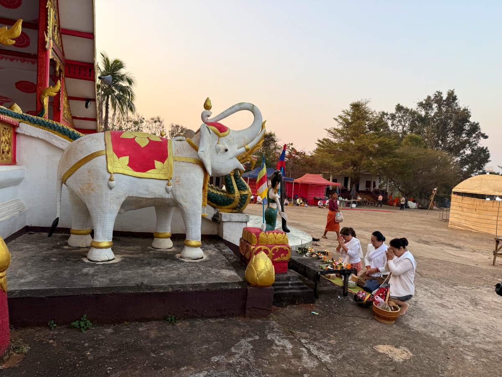
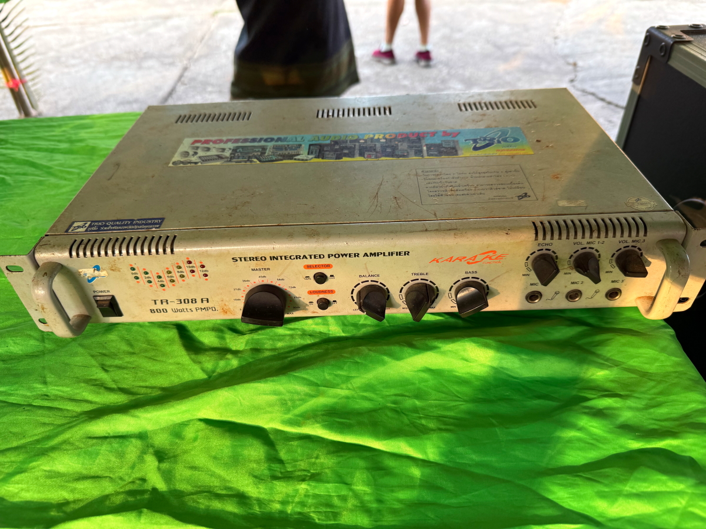
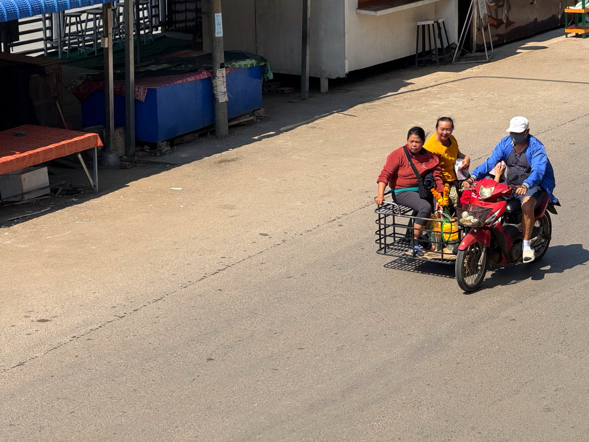

# 20250212_chiangrai

<html>
<head>

<meta charset="UTF-8">
<meta http-equiv="Content-Type" content="text/html; charset=UTF-8">
<meta http-equiv="X-UA-Compatible" content="IE=EmulateIE10" />
<meta http-equiv="X-UA-Compatible" content="IE=edge">

<!--ここから上はお決まりの定型文です-->

<!--ここからが表現の書式などを決めるcssという部分-->

<link href="https://cdnjs.cloudflare.com/ajax/libs/lightbox2/2.7.1/css/lightbox.css" rel="stylesheet">

</head>

<body>

モバイル端末をお使いの場合は、画面を横向きにすると
より見やすくご覧頂けます。

<!--ここ上は、ほぼそのまま使います！-->

<!--QRコードの挿入例-->

 アクセス用QRコード

<marquee direction="left" scrollamount="20" width="30%">(^_^)/~alis</marquee>

<!--流れ文字の挿入例-->
<h1><marquee behavior="left">!!! 2025/02/12、ラオス滞在2日目、朝からお寺のイベントを見学!!!</marquee></h1>

                          

<!--ここから下が、本体部分-->

<h2>ホテル創始者のおばあちゃんが朝一番でお寺のイベントに連れ出してくれました</h2>

    
<h2>お寺に着くと、すでに何か始まってます</h2>

    
<h2>まずは本堂にお参り</h2>

    
<h2>日の出とともに週に一度のイベントがスタート</h2>

    
<h2>僧侶が総出で寄付を募ります（托鉢）</h2>
<iframe width="560" height="315" src="https://www.youtube.com/embed/BmvtRxRUEmc?si=3lkAp79Uxw7RP_XR" title="YouTube video player" frameborder="0" allow="accelerometer; autoplay; clipboard-write; encrypted-media; gyroscope; picture-in-picture; web-share" referrerpolicy="strict-origin-when-cross-origin" allowfullscreen></iframe> 

    
<h2>托鉢の後はお経を唱えてひと段落(GoogleMapsのクチコミリンクです)</h2>
<a href="https://maps.app.goo.gl/CmLaQTcieQnysHXD8" target="_blank">GoogleMapsのクチコミリンクに飛びます</a>
 
<h2>生画像はYouTubeに上がってます</h2>
<iframe width="560" height="315" src="https://www.youtube.com/embed/MgnskBAvviQ?si=AyI4QUlhyoZY285k" title="YouTube video player" frameborder="0" allow="accelerometer; autoplay; clipboard-write; encrypted-media; gyroscope; picture-in-picture; web-share" referrerpolicy="strict-origin-when-cross-origin" allowfullscreen></iframe> 
    

    
<h2>イベントの撮影担当、IT系僧侶</h2>

    
<h2>おみくじもありますが、引いても読めないので見るだけ</h2>

    
<h2>お寺のPAシステム</h2>

    
<h2>街中に咲いた百合</h2>

    
<h2>お寺から歩いてすぐの市場にお邪魔しました</h2>

    
<h2>バイクのメーカーが知らないブランドばかり</h2>

    
<h2>スポークがラジアル張り、日本でもあまり見ないかも・・・</h2>

    
<h2>一つ40バーツのお弁当購入、タイ人価格ですね。 おそらくラオス人は半額程度で流通してると思われますが、タイ感覚では相場。</h2>

    
<h2>市場に隣接した、おばあちゃんの親戚のお店で頂きました。</h2>

    
<h2>澱粉質の餃子の皮的なものにひき肉などの惣菜がまぶされたものでした</h2>

    
<h2>お店の鉢植えに朝日がさして綺麗</h2>

    
<h2>市場の神棚にお供物が備えられています</h2>

    
<h2>お掃除も始まりました</h2>

    
<h2>掃き掃除と拭き掃除は別分担</h2>

    
<h2>時計などの修理屋さん</h2>

    
<h2>仏壇の写真撮ってたら、おじさんがお金くれました 意味が良くわかりませんが日本円で約70円程度、熱帯エリアの不思議</h2>

    
<h2>お金をくれたおじさんは、市場の関係者の様です</h2>

    
<h2>お弁当食べたお店の主はおばあちゃんの姪っ子、おばあちゃんは76歳</h2>

    
<h2>別の親戚の新車で宿まで戻ります</h2>

    
<h2>宿のCafeでひと段落して記念撮影など</h2>

    
<h2>対岸の仏像様に朝日が当たって輝いてます</h2>

    
<h2>お昼はまたまた昨日のラーメン</h2>

    
<h2>ガスは来てないので薪がま</h2>

    
<h2>子連れの行商ママがバイクで来たのでとうもろこしを購入</h2>

    
<h2>メコン川に沈む夕陽が綺麗でした</h2>

    
<h2>日本語が書かれたヒュンダイ</h2>

    
<h2>白人さん達が結構いました</h2>

    
<h2>夕焼け画像集</h2>

    
<h2>日本の昭和が居ました</h2>

    
<h2>晩御飯は宿の前のこのお店で</h2>

    
<h2>宵の明星「金星」がタイ側に沈みます</h2>

    
<h2>3人分のビールと食事でラオス通過の276,000キープ、日本円で約2,000円弱</h2>

    
<h2>惣菜と缶ビール並べてパチリ</h2>

    

  
<h2>今日のBGMは Fall in Love with These Spanish Hits! Canciones de Amor</h2>
<iframe width="560" height="315" src="https://www.youtube.com/embed/642UTFYfu6Y?si=htFiW5oPMflZ3-Um" title="YouTube video player" frameborder="0" allow="accelerometer; autoplay; clipboard-write; encrypted-media; gyroscope; picture-in-picture; web-share" referrerpolicy="strict-origin-when-cross-origin" allowfullscreen></iframe> 

   
<h2>以上、ラオス2日目でお寺にお参り、メコン川の夕焼けグラデーションで終わりました。 ここまでご覧いただきありがとうございました。</h2>

     
<h2>
<a href="https://torokoid.github.io/20241126_chiangrai/" target="_blank">Back to the menu page</a>
</h2>

   

         

  

      

<!--本体はここまで-->

<!--画面に空白地帯を作って、背景が見えるようにしています-->
                                              

<!-- フッタ -->
<footer>

Copyright 2025/02/13 alis @ChiangRai

</footer>

<!--HPにさまざまなJavaScriptを呼び込むための書式-->

